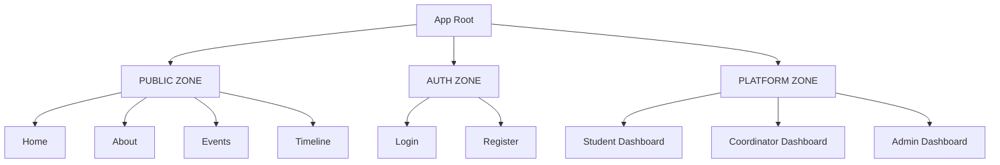

# LOGIN 2K26 — Frontend Client Documentation

This directory contains the React-based frontend client for the **LOGIN 2K26** Technical Symposium Web Platform.

---

## 🎯 Architecture Philosophy & Zones

The LOGIN 2K26 frontend is architected around **three distinct zones** to ensure security, maintainability, and clear separation of concerns:



### 1. Public Zone
* **Routes:** `Home`, `About`, `Events`, `Timeline`
* **Purpose:** Public-facing pages designed to captivate visitors, showcase events, and outline the symposium timeline.
* **UX/UI:** Highly animated, utilizing 3D assets and storytelling to align with the *“The Last Human”* theme.

### 2. Auth Zone
* **Routes:** `Login`, `Register` (Student/Alumni), `Forgot Password`, `Reset Password`
* **Purpose:** Entry point for registered users and incoming participants.
* **UX/UI:** Streamlined and lightweight, focusing on high usability, accessibility, and clean validation.

### 3. Platform Zone (Role-Protected Dashboards)
* **Routes:** `/dashboard/*` (Student), `/coordinator/*` (Event Head), `/admin/*` (SysAdmin)
* **Purpose:** Functional portals for users to manage profiles, pay fees, register for events, update event schedules, verify payments, and check attendance.
* **Security:** Secured using role-based route protection middleware.
* **UX/UI:** Completely clean, highly performant, lightweight layouts.

---

## 🛠️ Tech Stack & Performance Guardrails

While the platform features advanced animation capabilities, we enforce strict guidelines on where and how they are used to maintain high performance.

### Animation Strategy Matrix

| Tech / Library | Purpose | Recommended Usage |
| :--- | :--- | :--- |
| **Three.js + R3F + Drei** | 3D visual environments | Hero landing page, global site background elements, and select interactive experiences. |
| **GSAP** | Complex timeline sequences | Landing page orchestrations, cinematic transitions, and timeline scheduling components. |
| **Framer Motion** | Micro-interactions & UI transitions | Standard page route transitions, modal popups, accordion expansions, hover states. |
| **Lottie-React** | Pre-rendered vector animations | Decorative loaders, success/error feedback animations, empty-state illustrations. |

> [!WARNING]
> **Performance Guideline:** Do not use 3D (R3F) or heavy timeline animations inside the **Auth** or **Platform (Dashboards)** zones. Keep dashboards, login, and registration pages lightweight and clean to guarantee mobile responsiveness and zero lag during operation.

---

## 📁 Recommended Directory Structure

```text
src/
│
├── api/                      # Base configurations (Axios clients, interceptors)
│   ├── axios.ts
│   └── endpoints.ts
│
├── assets/                   # Static resources
│   ├── images/
│   ├── fonts/
│   └── lottie/
│
├── components/               # Shareable presentational UI components
│   ├── ui/                   # Atom-level components (Buttons, Inputs, Modals, Loaders)
│   │   ├── Button.tsx
│   │   ├── Input.tsx
│   │   └── Modal.tsx
│   ├── common/               # Layout elements (Navbar, Footer, Sidebars)
│   └── three/                # 3D canvas and webGL nodes (HeroScene)
│
├── features/                 # Domain-specific feature modules (Self-contained)
│   ├── auth/
│   ├── events/
│   ├── payments/
│   └── dashboard/
│
├── hooks/                    # Global utility hooks (useWindowSize, etc.)
│
├── layouts/                  # Base structural wrappers containing nested router outlets
│   ├── MainLayout.tsx
│   ├── DashboardLayout.tsx
│   └── AdminLayout.tsx
│
├── pages/                    # Route-level container components mapping to routes
│   ├── public/               # HomePage, AboutPage, EventsPage, TimelinePage
│   ├── auth/                 # LoginPage, RegisterPage
│   └── dashboard/            # DashboardHome, ProfilePage, PaymentPage
│
├── providers/                # App-level state / client wrappers (AppProviders)
│
├── routes/                   # Routing configuration & route protection guards
│
├── services/                 # Global API service classes
│
├── store/                    # Zustand store modules (authStore, notificationStore)
│
├── types/                    # Shared TypeScript interfaces & definitions
│
├── utils/                    # Utility helper functions
│
├── App.tsx                   # Main component shell
└── main.tsx                  # Vite entry point mounting the application
```

---

## 🧠 Development Standards

### 1. Feature-Based Architecture (Scalability Guard)
As the project grows, organize domain logic inside the `features/` directory rather than polluting global folders. Each feature should be self-contained:
```text
features/
├── auth/
│   ├── components/           # Feature-specific components (e.g., LoginForm)
│   ├── hooks/                # Feature-specific hooks (e.g., useAuthQuery)
│   ├── auth.service.ts       # Endpoint interactions
│   ├── auth.types.ts         # Authentication type schemas
│   └── authStore.ts          # Authentication Zustand state
```

### 2. Nested Routing for Dashboards
To prevent duplicate components and simplify layout updates, use nested layouts with React Router's `<Outlet />`:
* **Incorrect**: Creating duplicate layouts on individual routes (`/dashboard`, `/profile`, `/payment`) that redundantly mount sidebars/headers.
* **Correct**: Defining a wrapper `DashboardLayout` containing the sidebar, header, and an `<Outlet />` that dynamically renders the targeted child route (`DashboardHome`, `ProfilePage`, `PaymentPage`).

### 3. Route Protection
Wrap sensitive child routes in specialized protection guards (e.g., `ProtectedRoute`, `RoleGuard`) to intercept and validate user authentication and role claims before mounting components.

---

## 🚀 Getting Started

1. **Install Dependencies:**
   ```bash
   npm install
   ```
2. **Environment Configuration:**
   Create a `.env` file in the client directory and configure the backend endpoint:
   ```env
   VITE_API_URL=http://localhost:5000
   ```
3. **Run Development Server:**
   ```bash
   npm run dev
   ```
4. **Production Build:**
   ```bash
   npm run build
   ```
